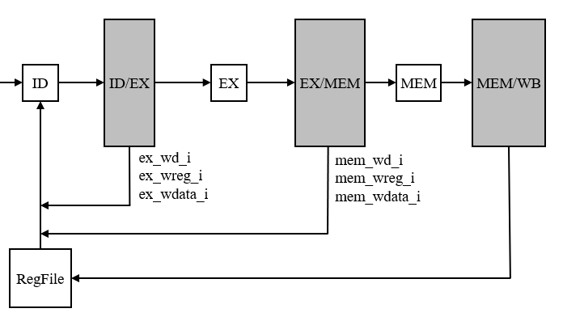

# MIPS32架构五级流水线处理器的Verilog实现
在该个人项目中，设计了一款MIPS32处理器核，设计成果利用Verilog代码表示。
- 本项目的接口定义与流水线框架基于雷思磊所著书籍《自己动手写CPU》中OpenMIPS的基本设计
- 进行该个人项目的目的：
  - 温习和拓展计算机体系结构知识
  - 了解基于硬件描述语言的体系结构设计的基本流程与方法
  - 体会RISC架构在体系结构设计方面的便利之处
- 截止目前，该项目实现的功能如下
  - 18条算术/逻辑指令
  - 6条移动指令
  - 6条移位指令
- 文件组织
.
├── rtl
│   ├── define.v     // 宏定义       
│   ├── pc_reg.v     // 程序计数器，对应取值阶段
│   ├── id.v         // 指令解码
│   ├── ex.v         // 指令执行
│   ├── mem.v        // 数据内存访问
│   ├── if_id.v      // 流水线寄存器
│   ├── id_ex.v      
│   ├── ex_mem.v
│   ├── mem_wb.v
│   ├── regfile.v    // 寄存器文件
│   ├── hilo_reg.v   // hi/lo寄存器 
│   ├── inst_rom.v   // 指令存储器
│   ├── openmips.v   // 处理器部分顶层模块    
│   ├── openmips_min_sopc // 顶层模块

---
### 1、流水线设计
该个人项目中采用五级流水线设计，流水线基本框架如下图所示

### 2、流水线功能模块设计
##### 2.1 PC模块：
1. 功能：根据PC寄存器的值完成取值以及PC的自增
2. 基本接口
   - input:  
     - clk: 时钟信号
     - rst: 复位信号
   - output: 
     - pc: 程序计数器
     - ce: 指令存储器使能信号

##### 2.2 ID 模块
1. 功能：
    - 对指令解码
    - 读取寄存器（解决数据相关问题）
    - 设置EX阶段的输入
2. 基本接口
   - input:
     - ex_/mem_六个输入用于判断数据相关问题，保证解码得到正确的寄存器值
     - pc_i: 当前指令的PC值
     - inst_i: 当前指令字段
     - reg1/2_data_i: 从寄存器堆中获取的寄存器值
   - output:
     - aluop_o: 指令要进行的操作
     - alusel_o: 指令类型（这两个输出指示EX阶段做出正确的操作）
     - reg1/2_o: 输出给EX阶段的运算数值
     - reg1/2_read/addr_o: 要读取的寄存器的信息：是否要读取以及读取哪个

##### 2.3 EX模块
1. 功能：
   - 根据解码阶段给出的运算类型，执行相应的计算与设定
   - 运算类型包括：算术运算，逻辑运算，移位运算
2. 基本接口
   - input
     - alu-_i: ID阶段传来的运算操作与类型，据此进行相应操作
     - reg1/2_i: EX阶段的两个操作数
     - wd_i: 要写入的寄存器
     - wreg_i: 是否要写入寄存器
     - hi/lo_i: hi/lo寄存器的值
   - output
     - whilo_o: 是否要修改HI/LO寄存器
     - hi/lo_o: 修改后的值
     - mem/wb_hi/lo/whilo_i &: 用于解决HI/LO寄存器的数据相关问题

##### 2.4 MEM模块
1. 功能：
   - 进行数据存储器进行读写（该功能尚未实现）
### 3、数据相关问题解决（RAW）
1. 问题根源：
    - 流水线中前面指令的**写回**落后于后续指令的**decode**
2. 关键因素
    - 相关指令的位置关系
      - 相邻
      - 相隔1条
      - 相隔2条
    - 相关数据产生的阶段
      - EX阶段
      - MEM阶段：load相关
##### 3.1 相关数据在EX阶段产生
1. 指令位置关系
    - 相邻：
    - 相隔1条：
    - 相隔2条：寄存器堆写与读同时进行，在regfile的设计中解决了这种情况

2. 解决方案：均可以通过数据前推解决
3. 电路设计：

##### 3.2 load相关：相关数据在mem阶段产生
### 4、指令解码
在ID解码阶段，根据MIPS文档给出的指令字段编码对指令进行解码
#### 4.1 opcode字段
opcode共六位，一个opcode指定一条或一类指令。部分指令通过opcode就可以完全确定，而一些指令则需要进一步观察其他字段才能确定
>
>- 标记有δ的字段表示该opcode对应一类命令，需要进一步判断
>- 6R标记表示该指令在MIPS Release6中移除或其编码发生了改变（本项目考虑pre R6的版本，没有考虑R6的改动）
>- 主要的指令类包括：
>    - 000000: SPECIAL: 包含部分算术、移位、逻辑、移动指令，多为R型三操作数指令
>    - 001xxx: 立即数算术逻辑运算，指令为I型
>    - 011100: SPECIAL2: 包含乘法运算的相关指令（MADD, MADDU, MUL, MSUB, MSUBU）和CLZ, CLO
#### 4.2 function字段
当一类指令具有相同的opcode时，可以通过function字段进一步识别指令
>**SPECIAL类指令的function字段：（opcode = 000000）**
>
>**SPECIAL2类指令的function字段：（opcode = 000000)**
>
### 4、功能检验
使用一段代码来检验其能否正常工作
```
_start:
   lui $1,0x0000          # $1 = 0x00000000
   lui $2,0xffff          # $2 = 0xffff0000

   ori $3,$1,0x00fe      # $3 = 0x000000fe
   xori $4,$1,0xff00      # $4 = 0x0000ff00

   movz $4,$2,$1          # $4 = 0xffff0000
   movn $3,$4,$2          # $3 = 0xffff0000

   mthi $2                # hi = 0xffff0000
   mtlo $1                # li = 0x00000000

   sll   $2,$2,8          # $2 = 0xffff0000 sll 8  = 0xff000000
   subu  $3,$3,$2         # $3 = 0x00ff0000
   add   $3,$2,$4         # overflow,$3 keep 0x00ff0000
```
运行结果如下
>